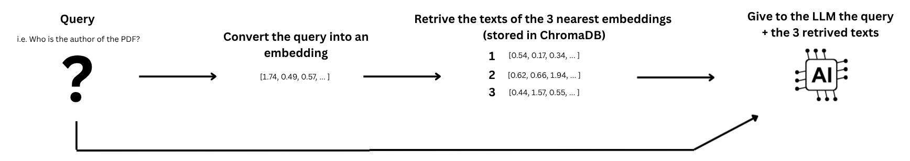

# RAG-based AI Assistant

This repository implements a lightweight **Retrieval-Augmented Generation (RAG)** system designed to answer questions based on the content of a PDF document.  
The workflow extracts text from a document, generates embeddings, stores them in a vector database, retrieves the most relevant chunks for a user query, and uses an LLM to produce an informed answer.

---

## Schema

  

  

---

## Overview

The pipeline is organized into five stages:

1. **PDF Extraction**  
   The document is parsed using the *Unstructured* library with layout analysis (`strategy="hi_res"`).  
   Text is split into coherent chunks (by section titles), cleaned, and saved to `chunks.jsonl`.

2. **Embedding Generation**  
   Each text chunk is encoded into a semantic vector using `SentenceTransformer("all-MiniLM-L6-v2")`.  
   These embeddings are stored in a persistent **ChromaDB** collection.

3. **Retrieval**  
   When a user submits a query, its embedding is compared to those in ChromaDB, and the **three most similar text blocks** are retrieved.

4. **Response Generation**  
   The query and retrieved texts are combined and sent to the **LLaMA 3.1 8B Instant** model (via the Groq API).  
   The model is instructed to answer **only** using the provided context.

Question: {query}
"""
