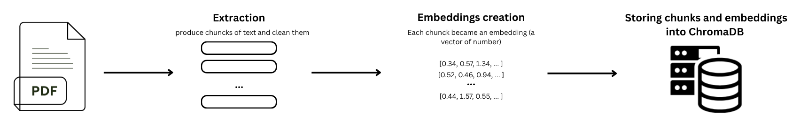
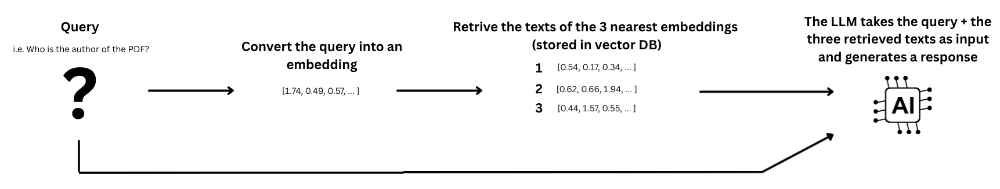

# RAG-based AI Assistant

This repository implements a lightweight **Retrieval-Augmented Generation (RAG)** system designed to answer questions based on the content of a PDF document.  
The workflow extracts text from a document, generates embeddings, stores them in a vector database, retrieves the most relevant chunks for a user query, and uses an LLM to produce an informed answer.

---

## Schema

  

  

---

## Overview

## Pipeline Description

The pipeline is organized into five main stages:

1. **PDF Extraction**  
   The process starts by parsing the input PDF using the **Unstructured** library with the `hi_res` strategy, which combines OCR and layout analysis for accurate extraction from complex documents.  
   The text is **divided into coherent chunks** based on section titles (`chunking_strategy="by_title"`), ensuring that each chunk represents a meaningful portion of the document.  
   After extraction, the text is cleaned to remove unnecessary whitespace, formatting artifacts, and punctuation inconsistencies.  
   The resulting set of normalized text blocks is saved to `chunks.jsonl`, ready for embedding generation.

2. **Embedding Generation**  
   Each text chunk is converted into a **semantic embedding** using the `SentenceTransformer("all-MiniLM-L6-v2")` model.  
   These embeddings are numerical representations that capture the underlying meaning of the text, enabling semantic comparison rather than simple keyword matching.  
   All embeddings and their associated text chunks are stored in a persistent **ChromaDB** collection, allowing the data to be efficiently retrieved and reused without recomputing embeddings.

3. **Retrieval**  
   When a user submits a query, the query is encoded into an embedding using the same SentenceTransformer model.  
   The system compares this query embedding against the stored embeddings in ChromaDB using cosine similarity to identify the **three most semantically relevant text chunks**.  
   These retrieved chunks serve as the contextual foundation for the next step, ensuring that the final answer is derived directly from the source document.

4. **Response Generation**  
   The selected chunks and the original query are merged into a structured prompt that instructs the model to answer strictly based on the retrieved context.  
   This prompt is sent to the **LLaMA 3.1 8B Instant** model via the **Groq API**, which generates a concise and context-grounded answer.
   
6. **Output Interpretation**  
   The generated response is presented as the final system output.  
   Since the answer is derived exclusively from the retrieved context, it reflects the actual contents of the source PDF, making the system suitable for document-based question answering and information retrieval tasks.

